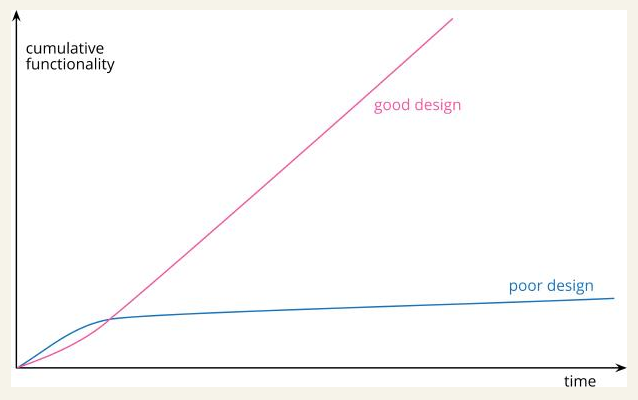

> chapter 1 of Working Effectively with Legacy Code

Four Reasons to Change Software

1. Adding a feature
2. Fixing a bug
3. Improving the design
4. Optimizing resource usage

|                   | Adding a Feature | Fixing a Bug | Refactoring | Optimizing |
|-------------------|------------------|--------------|-------------|------------|
| Structure         | Changes          | Changes      | Changes     |            |
| New Functionality | Changes          |              |             |            |
| Functionality     |                  | Changes      |             |            |
| Resource Usage    |                  |              |             | Changes    |

> chapter 2 of Refactoring

### Refactoring VS Performance optimization

**Refactoring is very similar to performance optimization**, as both involve carrying out code manipulations that *
*don’t change the overall functionality** of the program. **The difference is the purpose: Refactoring is always done to
make the code “easier to understand and cheaper to modify.” This might speed things up or slow things down.** With
performance optimization, I only care about speeding up the program, and am prepared to end up with code that is harder
to work with if I really need that improved performance.

### 2 hats

As I develop software, I find myself swapping hats frequently. I start by trying to add a new capability, then I realize
this would be much easier if the code were structured differently. So I swap hats and refactor for a while. Once the
code is better structured, I swap hats back and add the new capability. Once I get the new capability working, I realize
I coded it in a way that’s awkward to understand, so I swap hats again and refactor. All this might take only ten
minutes, but during this time I’m always aware of which hat I’m wearing and the subtle difference that makes to how I
program.

### Why Should We Refactor?

1. Refactoring Improves the Design of Software

   As people change code to achieve short-term goals, often without a full comprehension of the architecture, the code
   loses its structure.
2. Refactoring Makes Software Easier to Understand
3. Refactoring Helps Me Find Bugs
4. Refactoring Helps Me Program Faster

### When Should We Refactor?

The best time to refactor is just before I need to add a new feature to the code base.

> It’s like I want to go 100 miles east but instead of just traipsing through the woods, I’m going to drive 20 miles
> north to the highway, and then I’m going to go 100 miles east at three times the speed I could have if I just went
> straight there. When people are pushing you to just go straight there, sometimes you need to say, ‘Wait, I need to
> check the map and find the quickest route.’ The preparatory refactoring does that for me.
>
> — Jessica Kerr,

Whether I’m adding a feature or fixing a bug, refactoring helps me do the immediate task and also sets me up to make
future work easier. This is an important point that’s frequently missed. Refactoring isn’t an activity that’s separated
from programming—any more than you set aside time to write if statements. I don’t put time on my plans to do
refactoring; most refactoring happens while I’m doing other things.